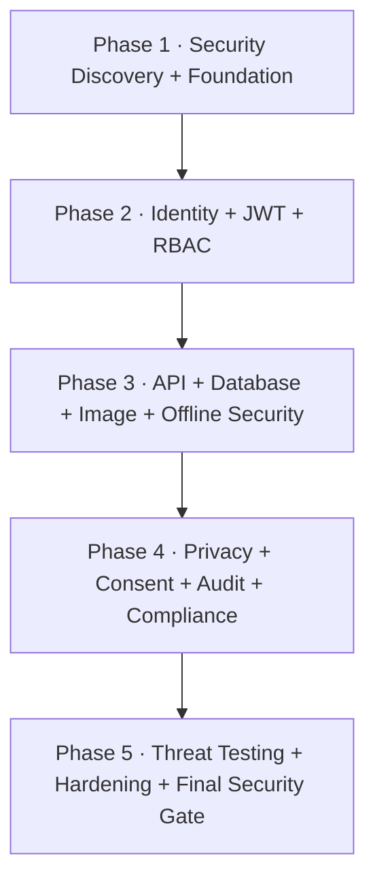

# HealthScreen AI — Security Execution Plan (Phase by Phase)

> **Audience:** AI coding agent (Antigravity), executing **one security phase at a time**.
>
> **Purpose:** Define *how*, *in what order*, and *with what verification* the complete security layer must be integrated into the existing HealthScreen AI project.
>
> **Companion file:** The existing HealthScreen AI README/project source explains *what the application already does*. This file explains how to add the security system without replacing the existing product.
>
> **Authority:** The existing project code and README win on existing functionality. This file wins on the security implementation order and security requirements.
>
> **Important:** This is a hackathon/research security implementation plan. It must not be represented as legal certification, medical-device approval, HIPAA certification, DPDP certification, or government approval.

---

## 0. Operating Rules (read every time)

1. **One phase per run.** Execute only the security phase explicitly requested. Do not start the next phase.
2. **Read before coding.** Before every phase, study the existing repository, relevant README sections, existing implementation, and this phase completely.
3. **Do not replace the application.** Integrate security into the existing HealthScreen AI architecture. Do not rewrite working AI, IQA, screening, referral, dashboard, storage, or Flutter functionality unnecessarily.
4. **Map before modifying.** Identify the actual authentication, API, database, image, offline-storage, sync, logging, and patient-data paths before adding controls.
5. **Do not invent existing functionality.** If a security capability already exists, harden or extend it rather than creating a duplicate system.
6. **Never trust client input.** Browser requests, Flutter requests, uploaded files, query parameters, local sync records, and external inputs are untrusted.
7. **Authentication is not authorization.** A valid JWT does not automatically grant access to a patient, screening, referral, image, or administrative operation.
8. **No secrets in git.** Never commit passwords, JWT secrets, encryption keys, API keys, database credentials, private keys, refresh tokens, or production credentials.
9. **No medical data in ordinary logs.** Never log patient names, phone numbers, addresses, images, health findings, access tokens, refresh tokens, passwords, or encryption keys.
10. **Tests are part of implementation.** A security feature without automated or reproducible verification is not complete.
11. **Preserve offline-first behavior.** Security must work when the mobile application is offline and must protect the local sync queue.
12. **Least privilege everywhere.** Users, services, database accounts, tokens, storage, and APIs receive only the permissions they require.
13. **Do not claim compliance automatically.** The implementation may be documented as **DPDP/ABDM-aligned** where applicable. It must not claim government certification or legal compliance without a deployment-specific assessment.
14. **Do not introduce unnecessary infrastructure.** Prefer the technologies already present in the repository unless a security requirement genuinely requires another dependency.
15. **Verification Gate is mandatory.** Every phase ends with a runnable gate. Do not mark a phase complete because the code merely looks correct.
16. **After repeated failure, stop.** If the same gate item fails after three meaningful fix attempts, create `BLOCKERS.md` containing the command, error, attempted fixes, and current state, then stop.
17. **Update progress.** Maintain `SECURITY_PROGRESS.md` after every phase.
18. **Commit per phase.** When the phase gate passes, commit with:
   `security-phase-N: <title>`
19. **Do not pre-build future phases.** A phase may create only the files and dependencies required for itself or explicitly shared security foundations.
20. **Study the entire project before Phase 1.** The first phase is not just coding; it establishes the security map of the real application.

---

## Kickoff Prompt

Use this when starting each phase:

```text
Read the entire existing HealthScreen AI project before making security changes.
Read security.md fully, then execute ONLY Security Phase <N> from security.md.

First inspect the current implementation relevant to this phase.
Do not replace working product functionality.
Do not start any later security phase.

Follow all Operating Rules.
Implement the phase.
Write tests alongside the implementation.
Run the complete Verification Gate for this phase.
Update SECURITY_PROGRESS.md.
Commit only if the gate passes.
Then stop.
```

---

# 1. Security Roadmap



| Phase | Title | Type of work |
|---|---|---|
| 1 | Security Discovery + Foundation | Audit / architecture / shared security foundation |
| 2 | Identity + JWT + RBAC | Authentication / authorization |
| 3 | API + Database + Image + Offline Security | Application / data protection |
| 4 | Privacy + Consent + Audit + Compliance | Governance / privacy / monitoring |
| 5 | Threat Testing + Hardening + Final Security Gate | Security testing / attack simulation / hardening |

---

# 2. Existing Project Security Boundaries

The security implementation must protect these existing areas rather than replacing them.

```text
┌─────────────────────────────────────────────────────────────┐
│                     HEALTHSCREEN AI                         │
├─────────────────────────────────────────────────────────────┤
│                                                             │
│  Flutter Mobile App                Next.js Web Platform      │
│  ┌──────────────────┐              ┌─────────────────────┐  │
│  │ Camera           │              │ Dashboard           │  │
│  │ IQA              │              │ Screening           │  │
│  │ Edge AI          │              │ History             │  │
│  │ SQLite           │              │ Referrals           │  │
│  │ Offline Queue    │              │ Analytics           │  │
│  └────────┬─────────┘              └──────────┬──────────┘  │
│           │                                   │             │
│           └───────────────┬───────────────────┘             │
│                           │                                 │
│                     API SECURITY                           │
│              Auth → RBAC → Validation → Rate Limit         │
│                           │                                 │
│                     BUSINESS LOGIC                          │
│                           │                                 │
│                  MongoDB / Storage                          │
│                           │                                 │
│                  Audit + Monitoring                         │
│                                                             │
└─────────────────────────────────────────────────────────────┘
```

The security layer must cover:

```text
Identity
Authentication
Authorization
API requests
Patient records
Screening records
Referral records
Medical images
Offline SQLite
Offline sync queue
MongoDB
Model files
Application logs
Consent
Audit records
Data export
Data deletion
```

---

# 3. Security Data Rules

## 3.1 Sensitive Data

Treat these as highly sensitive:

```text
Patient name
Phone
Address
Medical images
Screening results
Clinical findings
Referral information
Health history
```

Sensitive:

```text
Health-worker identity
Camp information
Authentication/session metadata
Device identifiers
Audit records
```

Low sensitivity:

```text
Aggregated anonymized statistics
Non-identifying application metrics
Application version
```

---

## 3.2 Security Data Flow

The intended protected flow is:

```text
Patient
  ↓
Privacy Notice / Consent
  ↓
Health Worker Authentication
  ↓
Camera / Patient Intake
  ↓
Image Validation
  ↓
IQA Gate
  ↓
Edge AI
  ↓
Encrypted Local Storage
  ↓
Encrypted Sync Queue
  ↓
TLS
  ↓
Authenticated API
  ↓
Authorization
  ↓
Input Validation
  ↓
Business Logic
  ↓
Protected Database
  ↓
Audit Event
```

---

## 3.3 Authentication Model

Use:

```text
Short-lived Access JWT
+
Rotating Refresh Token
+
Server-side Session/Revocation State
```

Access tokens should contain only minimum claims.

Example:

```json
{
  "sub": "opaque-user-id",
  "role": "HEALTH_WORKER",
  "iat": 0,
  "exp": 0,
  "jti": "unique-token-id"
}
```

Never put patient information or medical findings into JWTs.

---

## 3.4 Roles

The initial RBAC model is:

```text
HEALTH_WORKER
DOCTOR
CAMP_ADMIN
SYSTEM_ADMIN
AUDITOR
```

Permissions must be adapted to the actual application.

Example permissions:

```text
PATIENT_CREATE
PATIENT_READ
PATIENT_UPDATE
PATIENT_DELETE

SCREENING_CREATE
SCREENING_READ
SCREENING_UPDATE

REFERRAL_CREATE
REFERRAL_READ
REFERRAL_UPDATE

ANALYTICS_READ

AUDIT_READ
USER_MANAGE
CONSENT_MANAGE
DATA_EXPORT
```

---

## 3.5 API Security Order

Every protected API operation should conceptually execute:

```text
Request
 ↓
Security Headers
 ↓
Request ID
 ↓
Rate Limit
 ↓
CORS
 ↓
Authentication
 ↓
Authorization
 ↓
Input Validation
 ↓
Business Rules
 ↓
Database / Service
 ↓
Audit Event
 ↓
Safe Response
```

No database operation should occur before authentication/authorization/validation where those controls apply.

---

# PHASE 1 — SECURITY DISCOVERY + FOUNDATION

**Goal:** Study the entire existing project, map every security boundary, establish shared security configuration, remove obvious secret/logging weaknesses, and create the foundation required by later phases.

**Read:** Entire project repository, existing README, architecture documentation, package manifests, API routes, database layer, Flutter storage/sync implementation, authentication if present, image handling, model loading, logging, environment configuration, and this file §§0–3.

**Depends on:** Nothing.

## Tasks

1. Perform a complete security reconnaissance of the repository.
2. Identify every:
   - API endpoint
   - database operation
   - patient-data entry point
   - patient-data read/write path
   - image upload/read path
   - authentication path
   - session/token path
   - offline storage path
   - sync path
   - log path
   - model loading path
   - admin path
3. Create:
   ```text
   SECURITY_AUDIT.md
   ```
4. Document the real current state. Do not invent missing controls.
5. Create/update:
   ```text
   .env.example
   ```
6. Ensure secrets are not hard-coded or committed.
7. Review `.gitignore`.
8. Review existing dependencies for known security problems without blindly upgrading major versions.
9. Create a centralized security configuration compatible with the existing project structure.
10. Create shared security types/constants where required:
    - roles
    - permissions
    - security event names
    - security configuration
    - safe error categories
11. Identify and remove unsafe logging of patient/credential data.
12. Establish a request-ID/correlation mechanism if one does not already exist.
13. Establish the project security error-handling convention.
14. Create:
    ```text
    SECURITY_PROGRESS.md
    ```
    with all five security phases marked `⬜ todo`.
15. Document all assumptions and conflicts discovered during reconnaissance.

## Files

Adapt to the existing project. Likely outputs:

```text
SECURITY_AUDIT.md
SECURITY_PROGRESS.md
.env.example
.gitignore
lib/security/
  config.*
  constants.*
  types.*
  errors.*
```

Do not force this exact structure if the project already has an appropriate equivalent.

## Gate

- Existing application still starts.
- Existing tests pass.
- TypeScript/build passes.
- Lint passes.
- No real secret is present in tracked source.
- `.env.example` contains placeholders only.
- No password/token/encryption key appears in normal logs.
- `SECURITY_AUDIT.md` maps all major patient-data and API boundaries.
- `SECURITY_PROGRESS.md` exists.
- Security configuration is centralized.

**Do NOT:** implement JWT, RBAC, database encryption, consent, or major API changes yet.

---

# PHASE 2 — IDENTITY + JWT + RBAC

**Goal:** Establish secure identity, authentication, sessions, and server-side authorization for the existing web/API workflow.

**Read:** Phase 1 outputs, existing user/authentication implementation, all protected API routes, patient/screening/referral access patterns, this file §§3 and Phase 2.

**Depends on:** Phase 1.

## Tasks

1. Preserve any existing authentication architecture where it is sound; otherwise implement the required authentication layer.
2. Implement secure password hashing using **Argon2id** where password authentication is used.
3. Implement:
   ```text
   Access JWT
   Refresh Token
   ```
4. Access tokens must be short-lived.
5. Refresh tokens must be:
   - rotatable
   - revocable
   - tied to a session/token family
   - invalidated on logout
6. Detect refresh-token reuse and revoke the affected token family/session.
7. Implement secure JWT verification:
   - signature
   - expiry
   - issuer/audience where used
   - token type
   - required claims
   - `jti` where applicable
8. Never put patient or clinical information into JWT claims.
9. Implement the roles:
   ```text
   HEALTH_WORKER
   DOCTOR
   CAMP_ADMIN
   SYSTEM_ADMIN
   AUDITOR
   ```
10. Implement explicit permissions and server-side RBAC.
11. Implement resource-level authorization.
12. Prevent:
    ```text
    User A → valid JWT → Patient B
    ```
13. Implement logout/session revocation.
14. Add failed-login protection:
    - rate limiting
    - backoff/temporary lockout as appropriate
    - generic authentication errors
15. Do not reveal whether a username/account exists through authentication error messages.
16. Add MFA support for privileged roles where practical:
    ```text
    SYSTEM_ADMIN
    CAMP_ADMIN
    AUDITOR
    ```
17. Add authentication/security audit events:
    ```text
    LOGIN_SUCCESS
    LOGIN_FAILED
    LOGOUT
    TOKEN_REFRESH
    TOKEN_REUSE_DETECTED
    ACCOUNT_LOCKED
    ```

## Files

Adapt to the actual repository. Likely areas:

```text
lib/security/auth/
lib/security/authorization/
API middleware
user/auth models
session storage
tests/security/
```

## Gate

Prove with tests:

- Valid login succeeds.
- Password is never stored plaintext.
- Invalid credentials fail safely.
- Valid access JWT works.
- Expired JWT fails.
- Modified JWT fails.
- Wrong signature fails.
- Refresh token works.
- Refresh token rotates.
- Reused refresh token is rejected.
- Logout invalidates the session.
- Every protected API rejects anonymous access.
- RBAC rejects unauthorized roles.
- Resource authorization prevents cross-patient access.
- Privileged actions require appropriate role.
- Authentication rate limiting works.
- JWT contains no patient/medical data.
- Authentication events are audited.

**Do NOT:** redesign the patient database, image pipeline, offline queue, or compliance system yet.

---

# PHASE 3 — API + DATABASE + IMAGE + OFFLINE SECURITY

**Goal:** Protect the actual patient-data boundaries, API inputs, MongoDB operations, medical images, local SQLite data, and offline synchronization.

**Read:** Phase 1 and 2 outputs, every API endpoint, database/repository layer, image pipeline, Flutter SQLite/storage code, sync implementation, this file §§3 and Phase 3.

**Depends on:** Phase 2.

## Tasks

### A. API Validation

1. Add strict schema validation at every external API boundary.
2. Validate:
   - body
   - query
   - params
   - relevant headers
   - uploaded files
3. Reject unexpected fields where practical.
4. Use allowlists for fields that may be queried/updated.
5. Keep validation before business/database operations.

### B. MongoDB / NoSQL Injection

6. Audit every MongoDB query.
7. Never pass raw request objects directly into MongoDB.
8. Prevent uncontrolled MongoDB operators such as:
   ```text
   $where
   $ne
   $gt
   $gte
   $lt
   $lte
   $regex
   $or
   $and
   ```
   unless intentionally required and safely constructed.
9. Use explicit query schemas/allowlists.
10. Enforce least-privilege database credentials.
11. If SQL is introduced in future:
    - use parameterized/prepared queries only
    - never concatenate user input into SQL

### C. API Hardening

12. Implement strict CORS allowlists.
13. Implement security headers compatible with the existing Next.js deployment.
14. Implement rate limiting for at minimum:
    ```text
    login
    refresh
    password reset
    patient search
    screening
    image upload
    sync
    ```
15. Add request-size limits.
16. Return safe errors without:
    - stack traces
    - database errors
    - internal filesystem paths
    - secrets
    - implementation details

### D. Patient Data Protection

17. Separate direct identity data from clinical/screening data where practical.
18. Use opaque patient IDs internally.
19. Never place patient medical data in URLs.
20. Never place patient medical data in JWTs.
21. Never place raw medical data in ordinary logs.

### E. Encryption

22. Protect sensitive data at rest.
23. Use authenticated encryption such as:
    ```text
    AES-256-GCM
    ```
    where application-level encryption is required.
24. For Flutter/mobile storage, use secure OS key storage such as Android Keystore for encryption-key protection.
25. Never hard-code encryption keys in the mobile application.
26. Protect sensitive data in transit with TLS in deployed environments.

### F. Offline Storage + Sync

27. Identify exactly what the offline SQLite database stores.
28. Encrypt sensitive local records.
29. Encrypt the offline sync queue.
30. Implement:
    ```text
    Local record
      ↓
    Encrypt
      ↓
    Store
      ↓
    Reconnect
      ↓
    Authenticate
      ↓
    TLS
      ↓
    Server validation
      ↓
    Server storage
    ```
31. Prevent replay/duplicate synchronization.
32. Do not trust the client to declare a record as authorized or successfully synced.

### G. Medical Image Security

33. Treat every uploaded/captured image as untrusted.
34. Validate file signatures/magic bytes.
35. Validate MIME type.
36. Enforce file-size and resolution limits.
37. Reject unexpected formats.
38. Defend against:
    - malformed files
    - oversized files
    - decompression bombs
    - path traversal
    - executable content
    - malicious metadata
39. Strip unnecessary EXIF/GPS metadata where appropriate.
40. Generate server-side image identifiers.
41. Do not use user-controlled filenames as storage paths.
42. Never expose protected medical images through a public directory.
43. Require authentication and authorization to retrieve protected images.

### H. Model Integrity

44. Identify model files and model loading.
45. Add model version metadata.
46. Add SHA-256 integrity verification for expected model files.
47. Refuse to silently load a model whose expected integrity hash does not match.

## Files

Adapt to actual structure. Likely areas:

```text
API middleware
lib/security/validation/
lib/security/encryption/
lib/security/database/
lib/security/uploads/
Flutter secure storage / SQLite
sync service
model provider
tests/security/
```

## Gate

The following must be tested:

- NoSQL injection payloads are rejected.
- Unexpected object/operator input is rejected.
- Unauthorized patient lookup fails.
- Cross-patient access fails.
- Unauthorized image access fails.
- Malicious/fake image files fail validation.
- Oversized image fails.
- Path traversal fails.
- API rate limits trigger.
- CORS rejects unauthorized origin.
- Security headers are present.
- Sensitive error details are hidden.
- Offline medical records are encrypted.
- Offline sync queue is protected.
- Replay/duplicate sync is rejected safely.
- Database uses least privilege.
- Model hash mismatch is detected.
- Existing screening/IQA/inference functionality still works.

**Do NOT:** implement consent/retention/legal workflows or the final threat-model review yet.

---

# PHASE 4 — PRIVACY + CONSENT + AUDIT + COMPLIANCE

**Goal:** Add privacy-by-design, consent management, data lifecycle controls, security auditability, monitoring, and India-focused DPDP/ABDM alignment.

**Read:** Existing patient-data models/workflows, Phase 3 outputs, existing privacy/disclaimer screens, this file Phase 4, and all project documentation describing data collection/storage/sync.

**Depends on:** Phase 3.

## Tasks

### A. Privacy by Design

1. Map every category of patient data collected.
2. Remove unnecessary data collection where possible.
3. Document the purpose for each retained category.
4. Keep identity and clinical data separated where practical.

### B. Consent

5. Implement an explicit consent record containing at minimum:
   ```text
   consentId
   patientId
   purpose
   policyVersion
   grantedAt
   withdrawnAt
   status
   collectedBy
   ```
6. Support separate purposes where applicable:
   ```text
   SCREENING
   REFERRAL
   FOLLOW_UP
   RESEARCH
   MODEL_IMPROVEMENT
   ```
7. Do not automatically treat screening consent as research/model-training consent.
8. Version the privacy/consent notice.
9. Record which policy version was presented.

### C. Privacy Notice

10. Add a clear privacy notice covering:
    - data collected
    - purpose
    - storage
    - synchronization
    - retention
    - withdrawal
    - deletion/access process
    - responsible contact/grievance mechanism
11. Keep the notice understandable to the intended health-worker workflow.

### D. Data Lifecycle

12. Define documented retention rules for:
    ```text
    patient identity
    screening records
    images
    referrals
    consent records
    authentication logs
    security audit logs
    research data
    ```
13. Do not invent legally mandatory retention periods.
14. Make retention policy configurable where appropriate.
15. Implement controlled data deletion/erasure workflows subject to applicable retention obligations.
16. Support access/correction workflows where applicable.

### E. Audit Logging

17. Create an append-only security/audit event system.
18. Include events such as:
    ```text
    PATIENT_CREATED
    PATIENT_VIEWED
    PATIENT_UPDATED
    PATIENT_DELETED
    SCREENING_CREATED
    SCREENING_VIEWED
    IMAGE_ACCESSED
    REFERRAL_CREATED
    DATA_EXPORTED
    DATA_DELETED
    CONSENT_GRANTED
    CONSENT_WITHDRAWN
    SYNC_STARTED
    SYNC_COMPLETED
    SYNC_FAILED
    UNAUTHORIZED_ACCESS
    RATE_LIMIT_TRIGGERED
    SECURITY_ALERT
    ```
19. Every event should contain safe metadata:
    ```text
    eventId
    timestamp
    actorId
    actorRole
    action
    resourceType
    resourceId
    result
    requestId
    ```
20. Never put raw patient/medical content in audit events.

### F. Audit Tamper Evidence

21. Where practical, make audit records tamper-evident using a hash chain:

```text
Event N
  ↓
hash(Event N + previousHash)
  ↓
Event N+1
```

22. Document that tamper-evident logging does not make the entire application immutable.

### G. Security Monitoring

23. Detect:
    - repeated failed login
    - refresh-token reuse
    - repeated denied access
    - privilege changes
    - unusual exports
    - unusual administrative actions
    - suspicious sync behavior
24. Generate security events/alerts for high-risk activity.

### H. Incident Response

25. Create:
    ```text
    SECURITY_INCIDENT_RESPONSE.md
    ```
26. Define:
    ```text
    Detect
      ↓
    Contain
      ↓
    Investigate
      ↓
    Preserve evidence
      ↓
    Assess affected data
      ↓
    Notify responsible parties
      ↓
    Remediate
      ↓
    Review
    ```

### I. India-Focused Compliance Alignment

27. Document the architecture against applicable principles of:
    - Digital Personal Data Protection Act, 2023
    - Digital Personal Data Protection Rules, 2025
    - ABDM / Health Data Management privacy and security principles where applicable
28. Emphasize:
    ```text
    Consent
    Data minimization
    Purpose limitation
    Security safeguards
    Access control
    Auditability
    Retention/deletion governance
    Breach response
    Privacy by Design
    ```
29. Use the wording:
    ```text
    DPDP/ABDM-aligned
    ```
    rather than claiming certification or government approval.

30. If FHIR/HL7 export already exists or is later introduced, ensure exported health data is authenticated, authorized, minimized, validated, and audited.

## Files

Likely outputs:

```text
PRIVACY.md
RETENTION_POLICY.md
SECURITY_INCIDENT_RESPONSE.md
audit implementation
consent implementation
monitoring implementation
tests/security/
```

Adapt to the existing documentation structure.

## Gate

Verify:

- Consent can be recorded.
- Consent contains policy version.
- Withdrawal is represented.
- Privacy notice is versioned.
- Patient access is auditable.
- Medical data is absent from ordinary logs.
- Retention policy is documented.
- Deletion/erasure workflow exists.
- Security events are generated.
- High-risk events can be detected.
- Incident-response document exists.
- Audit records are tamper-evident where implemented.
- DPDP/ABDM alignment is documented without false certification claims.
- Existing clinical workflow still functions.

**Do NOT:** perform the final adversarial security review yet.

---

# PHASE 5 — THREAT TESTING + HARDENING + FINAL SECURITY GATE

**Goal:** Treat the completed security layer as an attack target, prove the controls work, harden weaknesses, and produce the final security documentation.

**Read:** Entire `security.md`, `SECURITY_AUDIT.md`, all security code/tests from Phases 1–4, project README, architecture documentation, and existing application tests.

**Depends on:** Phase 4.

## Tasks

### A. Threat Model

Create:

```text
THREAT_MODEL.md
```

Cover at minimum:

| Threat | Attack | Expected Defence |
|---|---|---|
| Stolen account | Credential abuse | JWT/session controls + RBAC |
| JWT theft/tampering | Modified/replayed token | Signature/expiry/revocation |
| Unauthorized patient access | IDOR | Resource authorization |
| NoSQL injection | Mongo operators | Strict schemas/allowlists |
| Malicious image | Disguised/oversized file | File validation |
| Data leakage | Logs/API responses | Data minimization + sanitization |
| Offline theft | Device/database access | Encrypted storage |
| Sync replay | Duplicate/malicious record | Authentication + server validation |
| Brute force | Repeated login attempts | Rate limiting/backoff |
| Model tampering | Modified model file | SHA-256 integrity |
| Insider abuse | Excessive permissions | RBAC + audit |
| Token reuse | Refresh token replay | Rotation + revocation |
| CORS abuse | Unauthorized origin | Allowlist |
| Malicious export | Bulk data extraction | Authorization + audit |

Also include an explicit:

```text
What We Do NOT Solve
```

section.

### B. Authentication Attack Tests

Test:

```text
expired JWT
invalid JWT
modified JWT
wrong signature
wrong role
refresh-token reuse
logout token
brute-force login
session revocation
```

### C. Authorization Attack Tests

Attempt:

```text
HEALTH_WORKER → another patient's record
HEALTH_WORKER → admin operation
DOCTOR → user management
AUDITOR → patient modification
anonymous → protected endpoint
```

### D. Injection Tests

Test:

```text
Mongo operators
nested malicious objects
unexpected fields
malformed IDs
prototype-pollution-style input where applicable
SQL injection only if SQL is introduced
```

### E. Upload Tests

Test:

```text
fake extension
wrong MIME type
malformed image
oversized image
path traversal
script payload
malicious metadata
```

### F. Privacy Tests

Search source, logs, API responses and JWTs for:

```text
patient names
phone numbers
medical findings
images
passwords
tokens
encryption keys
database credentials
```

Ensure sensitive data does not appear where it should not.

### G. Dependency + Secret Security

Run the project's appropriate:

```text
npm audit
```

and Flutter dependency/security checks.

Scan the repository for:

```text
API keys
JWT secrets
database URLs/passwords
private keys
cloud credentials
tokens
```

Do not blindly upgrade packages. Classify findings:

```text
Critical
High
Medium
Low
```

Document accepted risks.

### H. Security Headers + Browser Testing

Verify:

```text
CSP
HSTS
X-Content-Type-Options
Referrer-Policy
Permissions-Policy
frame protection
CORS
secure cookies if cookies are used
```

Ensure the policies do not break the existing Next.js application.

### I. Full Regression

Run all existing project tests plus all security tests.

Security changes must not break:

```text
patient intake
image capture/upload
IQA
AI inference
Grad-CAM++
screening history
referrals
dashboard
analytics
offline operation
sync
```

### J. Final Security Review

Create:

```text
SECURITY_REVIEW.md
```

It must contain:

```text
Implemented controls
Security test results
Known limitations
Accepted risks
Unimplemented controls
Compliance assumptions
Deployment requirements
Future hardening
```

## Gate

The project must demonstrate:

- [ ] Authentication works.
- [ ] JWT signature/expiry checks work.
- [ ] Refresh-token rotation works.
- [ ] Refresh-token reuse is detected.
- [ ] RBAC works.
- [ ] Resource-level authorization works.
- [ ] NoSQL injection defenses work.
- [ ] Image validation works.
- [ ] Rate limiting works.
- [ ] CORS is restricted.
- [ ] Security headers are present.
- [ ] Patient data is not exposed in logs.
- [ ] Patient data is not exposed in JWTs.
- [ ] Offline sensitive data is protected.
- [ ] Sync is authenticated and protected.
- [ ] Consent workflow works.
- [ ] Audit logging works.
- [ ] Security events are detectable.
- [ ] Model integrity checking works.
- [ ] Secrets are absent from source control.
- [ ] Threat model exists.
- [ ] Incident-response documentation exists.
- [ ] Existing project tests pass.
- [ ] Security tests pass.
- [ ] No unresolved Critical/High security issue remains unexplained.

**Do NOT:** add new product features unrelated to security.

---

# 4. SECURITY_PROGRESS.md FORMAT

Create in Phase 1:

```markdown
# Security Progress

| Phase | Title | Status | Date | Notes |
|---|---|---|---|---|
| 1 | Security Discovery + Foundation | ⬜ todo | YYYY-MM-DD | |
| 2 | Identity + JWT + RBAC | ⬜ todo | YYYY-MM-DD | |
| 3 | API + Database + Image + Offline Security | ⬜ todo | YYYY-MM-DD | |
| 4 | Privacy + Consent + Audit + Compliance | ⬜ todo | YYYY-MM-DD | |
| 5 | Threat Testing + Hardening + Final Security Gate | ⬜ todo | YYYY-MM-DD | |
```

Allowed status values:

```text
⬜ todo
⏳ in progress
✅ done
❌ blocked
```

Each completed phase must include a short note describing:

- files changed
- tests added
- verification result
- assumptions/deviations

---

# 5. Security Definition of Done

The security implementation is complete when the system can demonstrate:

```text
WHO ARE YOU?
      ↓
Authentication
      ↓
WHAT CAN YOU DO?
      ↓
RBAC + Resource Authorization
      ↓
IS THIS INPUT SAFE?
      ↓
Validation + Sanitization
      ↓
IS THE DATABASE OPERATION SAFE?
      ↓
Allowlisted / validated query
      ↓
IS THE IMAGE SAFE?
      ↓
File validation + limits
      ↓
IS THE DATA PROTECTED?
      ↓
Encryption + Access Control
      ↓
CAN WE PROVE WHAT HAPPENED?
      ↓
Audit Trail
      ↓
DID THE PATIENT CONSENT?
      ↓
Consent + Privacy Controls
      ↓
CAN WE RESPOND TO AN ATTACK?
      ↓
Monitoring + Incident Response
      ↓
CAN WE PROVE THE SECURITY WORKS?
      ↓
Threat Tests + Final Security Gate
```

The final product should be describable as:

> **HealthScreen AI is an offline-first preliminary screening platform with security and privacy controls integrated across identity, API access, patient-data storage, medical-image processing, offline synchronization, auditability, consent, and incident response.**

It remains a **preliminary screening assistant, not a diagnostic tool**.

---

# 6. Final Security Demo Scenarios

After Phase 5, the team should be able to demonstrate security to mentors/judges without creating separate demo-only security logic.

## Demo 1 — Unauthorized Patient Access

```text
Health Worker A
      ↓
Attempts Patient B
      ↓
Authorization check
      ↓
403 / denied
      ↓
Audit event
```

## Demo 2 — JWT Tampering

```text
Valid JWT
      ↓
Modify payload
      ↓
Signature verification fails
      ↓
Request rejected
```

## Demo 3 — NoSQL Injection

```text
Malicious Mongo operator
      ↓
Strict schema / allowlist
      ↓
Rejected
      ↓
Database never receives uncontrolled query
```

## Demo 4 — Malicious Medical Image

```text
Fake / oversized image
      ↓
File validation
      ↓
Rejected
      ↓
Security event
```

## Demo 5 — Offline Protection

```text
Screening completed offline
      ↓
Encrypted SQLite
      ↓
Encrypted sync queue
      ↓
Authenticated sync when online
```

## Demo 6 — Auditability

```text
Doctor views screening
      ↓
Audit event
      ↓
Actor + action + resource + timestamp
      ↓
No medical payload inside the log
```

## Demo 7 — Consent

```text
Patient consent
      ↓
Policy version recorded
      ↓
Screening permitted
      ↓
Consent withdrawal represented
```

## Demo 8 — Model Integrity

```text
Expected model hash
      ↓
Loaded model hash differs
      ↓
Model rejected
```

---

# 7. What This Security Plan Does Not Claim

The implementation does **not** by itself prove:

- medical-device regulatory approval
- diagnostic accuracy
- clinical safety certification
- DPDP legal compliance for every deployment
- government approval
- HIPAA compliance
- protection against a completely compromised operating system
- protection against every physical attack on a patient's device
- protection against all insider threats
- elimination of all medical-data breach risk

The security layer is intended to establish a strong, demonstrable **defense-in-depth architecture** suitable for the hackathon/research prototype and provide a foundation for a future professional security/compliance assessment.

---

# 8. Final Execution Rule

The AI coding agent must execute the security system in this exact order:

```text
Phase 1
Security Discovery + Foundation
        ↓
Verification Gate
        ↓
STOP

Phase 2
Identity + JWT + RBAC
        ↓
Verification Gate
        ↓
STOP

Phase 3
API + Database + Image + Offline Security
        ↓
Verification Gate
        ↓
STOP

Phase 4
Privacy + Consent + Audit + Compliance
        ↓
Verification Gate
        ↓
STOP

Phase 5
Threat Testing + Hardening + Final Security Gate
        ↓
Final Review
        ↓
STOP
```

**Never skip a phase gate. Never silently move to the next phase. Never replace existing HealthScreen AI functionality simply to make security implementation easier.**
